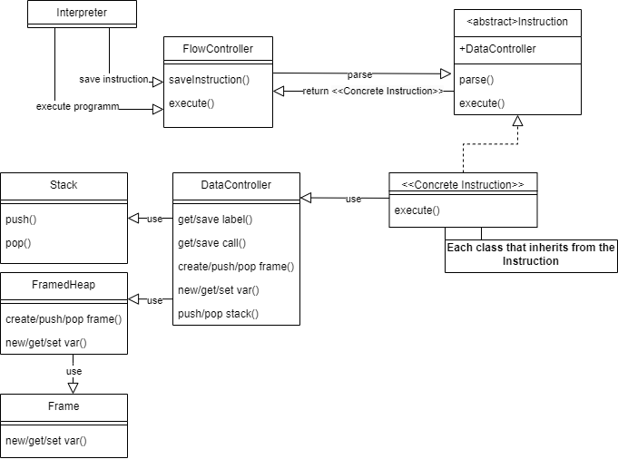

# Implementation documentation for Task 2 of the IPP 2023/2024 
### Name and surname: Nikita Smirnov
### Login: xsmirn02

## Summary
Interpreter for xml file processing from parse.py. It is assumed that the parser will already check the program for most of the errors that concern syntax and slightly semantics. 

The main idea was to first process all the operators in the source code, and then dynamically execute the program, which will achieve greater performance when using a large number of recursions and loops in the program. 

The code is organized into several modules, enhancing readability and facilitating maintenance.

## Design Overview

The entire code is divided down to three namespaces
* `IPP\Student`: contains the main program logic
* `IPP\Student\Instructions`: contains types and definitions of instructions for further processing
* `IPP\Student\Memory`: contains everything for working with memory including storage of labels, stack, frames, etc. 

`Instruction` class implements the Factory pattern. `Instruction::parse()` returns one of the classes that inherits from the `Instruction`. Based on the opcode attribute.
 

## Implementation Details
### Execution flow

- At the beginning, the entire program is saved in FlowController(by parsing instructions wih `FlowController->saveInstruction(DOMElement)`). From instructions, an instance of the corresponding class is created, which is described in `IPP\Student\Instructions\Instruction.php` and inherited from the abstract class `Instruction`.

- After that the program execution starts due to the function `execute(): int` at all instances of instructions. This function returns JumpCode:
    - `JumpCodes::NEXT`: indicates that the program should proceed to execution of the next line.
    - `negative code[0-9]`: indicates an exit with an error code given with the `EXIT <symb>` command. 
    - `positive code`: points to the line the program should jump to.

### Memory

The main functions (CRUD) for working with memory are performed by `DataController.php`, which implements two ways of storing variables:
- `FramedHeap`: implements functions for working with variables in memory(global, local, temporary) using `Frames` class 
- `Stack`: implements `POP` and `PUSH` functions and stack of variables.

Also `DataController` contains `labels` and `calls` storages for maintain jumps, calls, and returns.

`FramedHeap` implements frame management and getting variables from these frames based on the requested frame (which is parsed in `DataController` with `parseVar(string $varName): array{0: int, 1: string}`)

## UML Diagram

