# Introduction to C#, Visual Studio and .NET

<div class="right">[ Jan Pluskal &lt;pluskal@vut.cz&gt;  ]

---

## Introduction to Visual Studio

---

<div class="right">

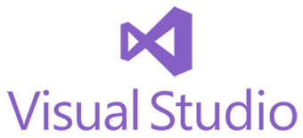

</div>

<div class="left">

* *Integrated development environment (IDE)*
* Feature-rich program that can be used for many aspects of software development:
  * editor
  * debugger
  * builder
  * completion tools
  * graphical designers
  * etc..
* [Free download](https://visualstudio.microsoft.com/vs/")
* [Installation guide](https://docs.microsoft.com/en-us/visualstudio/install/install-visual-studio?view=vs-2017)

</div>

+++


+++
## Comparison of Visual Studio versions
| Supported Features                 | Community | Professional | Enterprise |
| ---------------------------------- | --------- | ------------ | ---------- |
| Supported Usage scenarios          | ⚫⚫⚫◯      | ⚫⚫⚫⚫         | ⚫⚫⚫⚫       |
| Development Platform Support       | ⚫⚫⚫◯      | ⚫⚫⚫⚫         | ⚫⚫⚫⚫       |
| Integrated Development Environment | ⚫⚫⚫◯      | ⚫⚫⚫◯         | ⚫⚫⚫⚫       |
| Advanced Debugging and Diagnostics | ⚫⚫◯◯      | ⚫⚫◯◯         | ⚫⚫⚫⚫       |
| Testing Tools                      | ⚫◯◯◯      | ⚫◯◯◯         | ⚫⚫⚫⚫       |
| Cross-platform Development         | ⚫⚫◯◯      | ⚫⚫◯◯         | ⚫⚫⚫⚫       |
| Collaboration Tools and Features   | ⚫⚫⚫◯      | ⚫⚫⚫◯         | ⚫⚫⚫⚫       |

+++
## Only Enterprise features
* Code Map Debugger Integration
* .NET Memory Dump Analysis
* Test Case Management
* Code Coverage with tests
* IntelliTest
* ⋮

---
## Recommended extensions, services, and tools

<div class="left">

* Extensions:
  * **Resharper**
  * **Markdown Editor**
  * EF Core Power Tools
  * ~~Code Metrices~~
  * ~~GitFlow~~
  * ...
* Tools & Services:
  * **LinqPad**
  * DotPeek
  * Source Tree
  * **VSCode**
  * **Rider**
  * Azure DevOps
  * dotnet-cli

</div>

<div class="right">

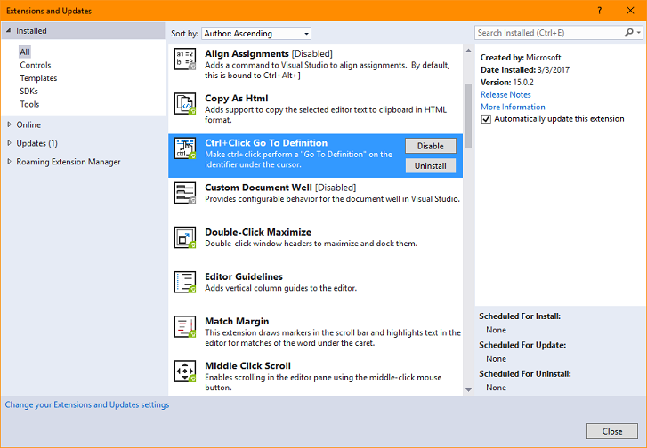

</div>

+++
### [Resharper](https://www.jetbrains.com/resharper/)

<div class="left">

Extends Visual Studio with code inspections. For most inspections provides quick-fixes to improve code in one way or another. Helps safely organize code and move it around the solution.

For more details see [features](https://www.jetbrains.com/resharper/features/).

</div>

<div class="right">

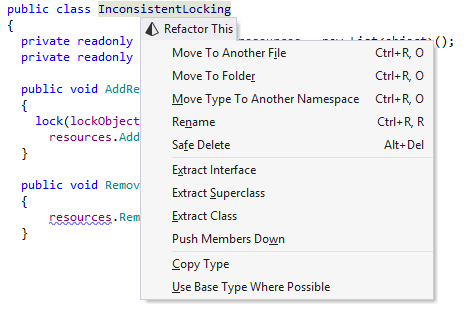

</div>

+++
### [Azure DevOps](https://azure.microsoft.com/en-us/services/devops/)

<div class="left">

* Before Visual Studio Team Services.
* Cloud-hosted private Git repositories
* Agile planning
* Build management
* Test Plans

</div>

<div class="right">


</div>


+++
### [Code Metrices](https://marketplace.visualstudio.com/items?itemName=Elisha.CodeMetrices)

<div class="left">

Visual Studio extension that helps to monitor the code complexity.
As you type, the method complexity "health" is updated, and the complexity is shown near the method.

**Only Visual Studio 2019** - submit PR if you find some usable for 2022!

</div>

<div class="right">


</div>


+++
### [Mnemonic templates](https://github.com/JetBrains/mnemonics)

Templates for ReSharper that let you quickly generate code and data structures by typing in names.


+++
### [LinqPad](http://www.linqpad.net/)

LinqPad is not just for LINQ queries, but any C# expression, statement block or program.
Put an end to those hundreds of Visual Studio Console projects cluttering your source folder and join the revolution of LINQPad scripters and incremental developers.


+++
### [DotPeek](https://www.jetbrains.com/decompiler/)

Tool based on ReSharper's bundled decompiler.
It can reliably decompile any .NET assembly into equivalent C# or IL code.

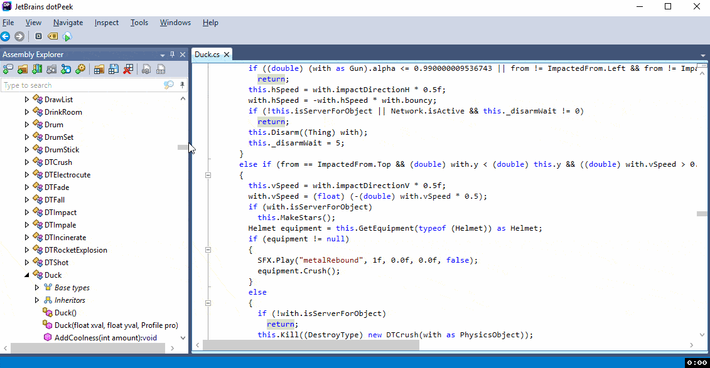

+++
### [Markdown Editor](https://marketplace.visualstudio.com/items?itemName=MadsKristensen.MarkdownEditor)

A full-featured Markdown editor with live preview and syntax highlighting.
Supports GitHub flavored Markdown.

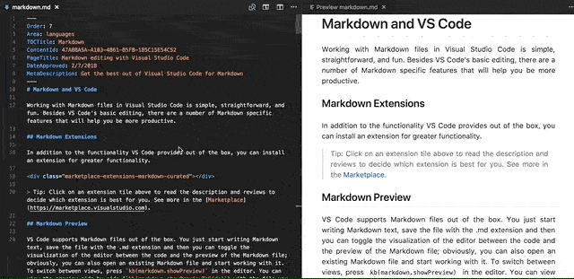

+++
### [EF Core Power Tools](https://marketplace.visualstudio.com/items?itemName=ErikEJ.EFCorePowerTools)

Useful design-time utilities for EF Core, accessible through the Visual Studio Solution Explorer context menu when right-clicking on a file containing a derived DbContext class.

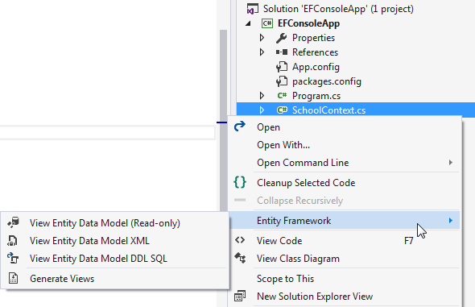

+++
### [GitFlow](hhttps://marketplace.visualstudio.com/items?itemName=vs-publisher-57624.GitFlowforVisualStudio2019)

Team Explorer extension integrates GitFlow into your development workflow. It lets you easily create and finish feature, release and hotfix branches right from Team Explorer.  For more details about git recommends [Pro Git book](https://git-scm.com/book/en/v2).


+++

### [Semantic Versioning 2.0.0](https://semver.org)

Given a version number **MAJOR.MINOR.PATC**H, increment the:

1. **MAJOR** version when you make incompatible API changes
2. **MINOR** version when you add functionality in a backward compatible manner
3. **PATCH** version when you make backward compatible bug fixes

Additional labels for pre-release and build metadata are available as extensions to the MAJOR.MINOR.PATCH format.

+++

### [semantic-release](https://semantic-release.gitbook.io/semantic-release/)

semantic-release automates the whole package release workflow including: determining the next version number, generating the release notes, and publishing the package.

This removes the immediate connection between human emotions and version numbers, strictly following the Semantic Versioning specification and communicating the impact of changes to consumers.

+++

### [Conventional Commits](https://www.conventionalcommits.org/en/v1.0.0/)

```
<type>[optional scope]: <description>

[optional body]

[optional footer(s)]
```

The commit contains the following structural elements, to communicate intent to the consumers of your library:

1. *fix:* a commit of the type fix patches a bug in your codebase (this correlates with PATCH in Semantic Versioning).
2. *feat:* a commit of the type feat introduces a new feature to the codebase (this correlates with MINOR in Semantic Versioning).
3. *BREAKING CHANGE:* a commit that has a footer *BREAKING CHANGE:*, or appends a *!* after the type/scope, introduces a breaking API change (correlating with MAJOR in Semantic Versioning). A *BREAKING CHANGE* can be part of commits of any type.
4. types other than *fix:* and *feat:* are allowed, for example @commitlint/config-conventional (based on the Angular convention) recommends *build:*, *chore:*, *ci:*, *docs:*, *style:*, *refactor:*, *perf:*, *test:*, and others.
5. footers other than *BREAKING CHANGE:* <description> may be provided and follow a convention similar to git trailer format.

---
## Why To Choose .NET?
<div class="right">


</div>

* Productivity
* Almost every platform
* Performance
* Security
* Large ecosystem
* Open source


+++
### Productivity
* To develop *high quality applications faster*
* Modern language constructs
  *  *Generics*
  *  Language Integrated Query (*LINQ*)
  *  *Asynchronous programming*
* Extensive class libraries - NuGet
* Common APIs
* *Multi-language* support


+++
### Almost every platform
* iOS
* Android
* Windows
* Windows server
* Linux
* Micro-services on cloud


+++
### Performance
* Applications provide better response times and require less computing power.
* Comparison of web application frameworks with tasks like
  * JSON serialization,
  * database access,
  * and server side template rendering.

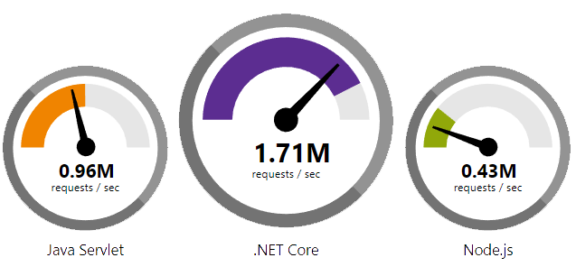
[Source](https://www.techempower.com/benchmarks/#section=data-r16&hw=ph&test=composite)

+++
### Security
* Immediate **security** benefits via its *managed runtime*
* Prevents *critical issues* like **buffer overflow**
* Patches are released with runtime

+++
### Large ecosystem
* Libraries from the [NuGet package manager](https://www.nuget.org/)
* Visual studio [marketplace](https://marketplace.visualstudio.com/)
* [Extensive partners network](https://vspartner.com/Directory)
* Community support, MVPs, ...

+++
### Open source
* [**.NET Foundation**](https://dotnetfoundation.org/)
* [.NET Core](https://github.com/dotnet/core)
* [.NET Runtime/CoreFX](https://github.com/dotnet/runtime)
* [ASP.NET Core](https://github.com/dotnet/aspnetcore)
* [EF Core](https://github.com/dotnet/efcore)
* [WPF](https://github.com/dotnet/wpf)
* [MAUI](https://github.com/dotnet/maui)* 
* [.NET Standard (archived)](https://github.com/dotnet/standard)
* [Reference Source - .NET Framework (readonly)](https://github.com/microsoft/referencesource)
* Independent, Innovative, Commercially-friendly
* Google, JetBrains, Red Hat, Samsung, Unity...

---
# .NET Platform
<div class="right">


</div>


* Language interoperability
* Architecture
* Common Language Runtime
* Benefits
* Garbage collector
* In The Nutshell
* The .NET family of frameworks

[Source](https://blogs.msdn.microsoft.com/cesardelatorre/2016/06/27/net-core-1-0-net-framework-xamarin-the-whatand-when-to-use-it/)


+++
## Language interoperability
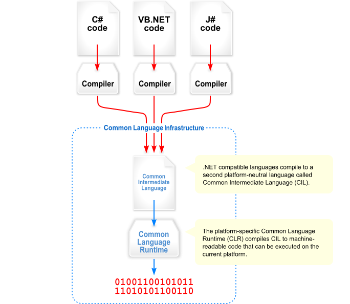


+++
## Architecture
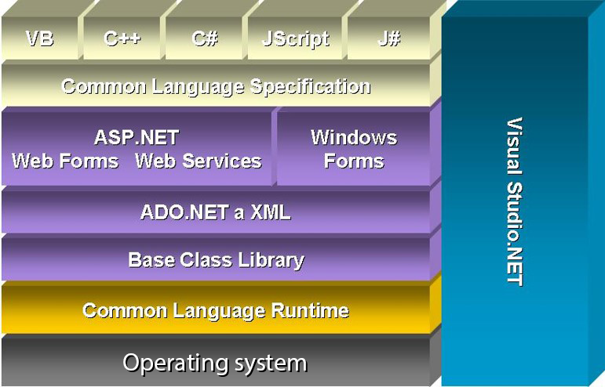

+++
## CLR - Common Language Runtime
* The virtual machine component of .NET
* Manages the execution
* Just-in-time compilation
* Similar to Java Virtual Machine

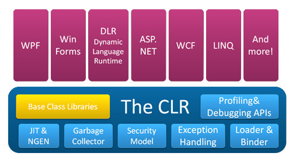

+++
## CLR - Benefits
* Performance improvements - *JIT*
* Easy use of *components developed in other languages*
* Extensible *types defined in BCL*
* *Inheritance, interfaces, and overloading* for OOP
* [Free threading](https://stackoverflow.com/questions/3892259/difference-between-free-threaded-and-thread-safe) (MTA Apartment)
* Structured *exception handling*
* Custom *attributes*
* **Garbage collection**
* *Delegates* instead of function pointers

+++
### Garbage collector
* **Automated memory management** without need of programmer intervention
* Uses reachability from GC roots to identify *alive* objects
* *Three generations*

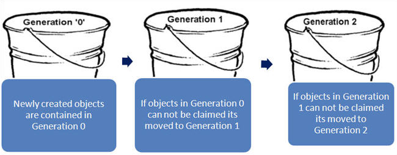


+++
## C# - In The Nutshell
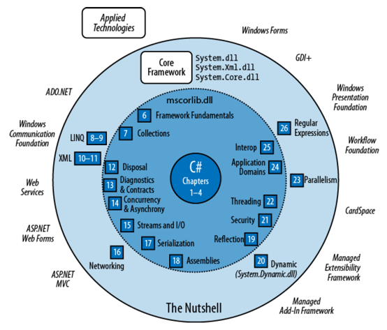

+++
## Standard Libraries
| Library                            | Namespaces                                                                                                                |
| ---------------------------------- | ------------------------------------------------------------------------------------------------------------------------- |
| **Base Class Library**             | *System, System.Collections, System.Collections.Generic, System.Diagnostics, System.IO, System.Text, System.Threading...* |
| **Runtime Infrastructure Library** | *System, System.Reflection, System.Runtime.CompilerServices, System.Runtime.InteropServices...*                           |
| **Network Library**                | *System, System.Net, System.Net.Sockets...*                                                                               |
| **Reflection Library**             | *System.Globalization, System.Reflection...*                                                                              |
| **XML Library**                    | *System.Xml*                                                                                                              |
| ⋮                                  | ⋮                                                                                                                         |

+++
## The .NET family of frameworks
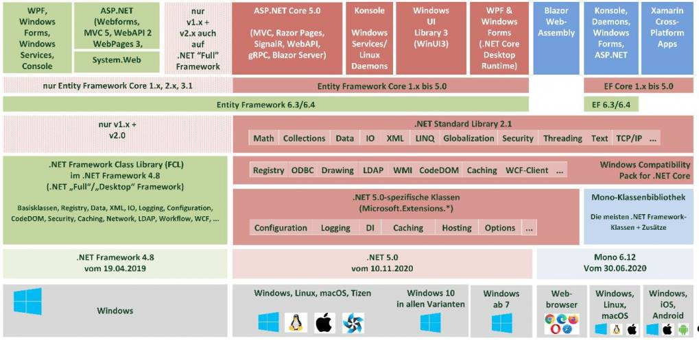

---
# C# 101
<div class="right">


</div>

<div class="left">

* Identifiers
* Keywords
* Literals
* Delimiters
* Operators
* Comments
* Datatypes
* Value Types

</div>

+++
## C# is
* **multi-paradigm**;
* **strong typed**;
* **object oriented** (class-based);
* imperative, declarative;
* functional, generic;
* based on c++;
* programming language.

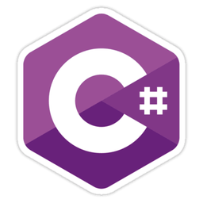

+++
<pre><code class="language-csharp" data-sample='assets/sln/Tests/HelloWorld.cs' data-sample-line-numbers="true" data-sample-indent="remove"></code></pre>

<!-- +++?code=assets/sln/Tests/HelloWorld.cs&lang=C#&title=Hello World Sample
@[1]
@[3-4, 15]
@[5-6, 14]
@[7-8, 13]
@[9]
@[11]
@[12]
@[1-15] -->
[Code sample](assets/sln/Tests/HelloWorld.cs)

+++
## Identifiers
* Name given to entities such as *variables*, *methods*, *classes*, etc.
* Tokens which uniquely identify elements
* `value` is a identifier:
  ```C#
  int value;
  ```
* **Reserved keywords** can not be used unless prefix `@` is added
  ```C#
  int @class;
  ```
+++
## Keywords
* **Reserved** words that have *special meaning*
* Meaning can not be changed
* **Can not be directly** used as *identifies*
* `long` is a keyword:
  ```C#
  long count;
  ```
* E.g. ```int, bool, if, for, class, false, public, break```
* [List of all Keywords](https://docs.microsoft.com/en-us/dotnet/csharp/language-reference/keywords/)

+++
## Contextual Keywords
* **Specific meaning** in a limited program *context*
* **Can be used** as *identifiers outside the context*
* E.g. ```var, await, async, where, set```
* [List of all Contextual Keywords](https://docs.microsoft.com/en-us/dotnet/csharp/language-reference/keywords/)

+++
## Literals
* Data inserted in a code
```C#
var hitchhikerConstant = 42;
var helloWorld = "Hello World";
var pi = 3.14159;
```

+++
## Delimiters
* Characters used to structure the code
* Curly braces `{`, `}`
  * Creates **code blocks**
  * Used to **impart a scope**
* Semicolon `;`
  * **Delimits statements**
  * Statement *can be written on multiple lines*.

```C#
Console.WriteLine
    (1 + 2 + 3 + 4 + 5);
```

+++
## Operators
  * Used to **combine multiple expressions**
  * E.g., `. () * + -`

```C#
var sum = 1 + 5 * (6 / 2);
```

+++
## Comments
* Line
  ```C#
  // line comment
  ```
* Block -  **Do not use block comments!!!**
  ```C#
  /* Comment can be split
  into multiple lines */
  ```
* Documentation
  ```C#
  /// <summary>
  /// Documents class, method...
  /// </summary>
  ```

---
## Datatypes
* Instruct the compiler or interpreter how the programmer intends to use the data
* **Value type**
  * Variable directly **contains data**
  * **Have to be** assigned before accessing
  * Two variables, each have their copy of the data; *an operation on one variable* **DOES NOT** *affect the other*.
* **Reference types** (objects)
  * Variable **stores reference** to the data
  * **DO NOT have to be** assigned before accessing
  * IF two variables reference the same object; *operation on one variable* **DOES** *affect the object referenced by the other variable*.
* [Documentation](https://docs.microsoft.com/en-us/dotnet/csharp/tour-of-csharp/types-and-variables)

+++
## Value Types

* **Simple Types**
  * Signed integral: `sbyte, short, int, long`
  * Unsigned integral: `byte, ushort, uint, ulong`
  * Unicode characters: `char`
  * IEEE floating point: `float, double`
  * High-precision decimal: `decimal`
  * Boolean: `bool`
* **Enum types**
  * User-defined types of the form `enum E {...}`
* **Struct types**
  * User-defined types of the form `struct S {...}`
* **Nullable value types** - become reference types
  * Extensions of all other value types with a `null` value
  * [Boxing/Unboxing](https://docs.microsoft.com/en-us/dotnet/csharp/language-reference/builtin-types/nullable-value-types#boxing-and-unboxing)

+++
### Signed Integral
| Type    | Size    | Range                                                              |
| ------- | ------- | ------------------------------------------------------------------ |
| `sbyte` | 8 bits  | range from -128 - 127                                              |
| `short` | 16 bits | range from -32,768 - 32,767                                        |
| `int`   | 32 bits | range from -2,147,483,648 - 2,147,483,647                          |
| `long`  | 64 bits | range from –9,223,372,036,854,775,808 to 9,223,372,036,854,775,807 |

+++
### Unsigned integral
| Type     | Size    | Range                                     |
| -------- | ------- | ----------------------------------------- |
| `byte`   | 8 bits  | range from 0 - 255                        |
| `ushort` | 16 bits | range from 0 - 65,535                     |
| `uint`   | 32 bits | range from 0 - 4,294,967,295              |
| `ulong`  | 64 bits | range from 0 - 18,446,744,073,709,551,615 |

+++
### Floating point
| Type     | Size    | Range                                                               |
| -------- | ------- | ------------------------------------------------------------------- |
| `float`  | 32 bits | range from $$1.5 × 10^{−45} - 3.4 × 10^{38}$$  7-digit precision    |
| `double` | 64 bits | range from $$5.0 × 10^{−324} - 1.7 × 10^{308}$$  15-digit precision |

+++
### Decimal
| Type      | Size     | Range                                                                                        |
| --------- | -------- | -------------------------------------------------------------------------------------------- |
| `decimal` | 128 bits | range is at least $$–7.9 × 10^{−28} - 7.9 × 10^{28}$$ with at least 28-digit precision range |


+++
### Literals notation
* Classical
  * E.g., `127`, `42`, etc...
* Hexadecimal
  * E.g., `0x7F`, `0x2A`, etc...
* Binary
  * E.g., '0B110010', '0b0010_0110_0000_0011', etc...
* Decimal
  * `'.'` character as a delimiter
  * `'e'` character as an exponent

+++
### Numerical data types specification
Using specific character as a suffix

```C#
 Console.WriteLine(1f.GetType());  // Float   (float)
 Console.WriteLine(1d.GetType());  // Double  (double)
 Console.WriteLine(1m.GetType());  // decimal (decimal)
 Console.WriteLine(1u.GetType());  // UInt32  (uint)
 Console.WriteLine(1L.GetType());  // Int64   (long)
 Console.WriteLine(1ul.GetType()); // UInt64  (ulong)
```

+++
### Numerical data types casting
* Transformation of **integral type** to **integral type**:
  * *implicit* when *target type* can accommodate the whole range of *source type*
  * *explicit* otherwise
* Transformation of **decimal type** to **decimal type**:
  * `float` can be *implicitly* casted to `double`
  * `double` has to be casted *explicitly* to `float`
* Transformation of **integral type** to **decimal type**:
  * Casting is *implicit*
* Transformation of **decimal type** to **integral type**:
  * Casting has to be *explicit*
    * Lost precision
    * Truncation can occur

---
## Arithmetic operations
* `+` addition
* `-` subtraction
* `*` multiplication
* `/` division
* `++` incrementation
* `--` decrementation

+++
### Byte, sbyte, short, ushort types
* 8 and 16 bits types do not have arithmetical operations
  * E.g., `byte, sbyte, short, ushort`
  * Compiler does implicitly cast to a large type `int, uint`
```C#
short x = 1, y = 1;
short z = x + y;    // Compile-time error
```
  * Solution is to do an explicit cast
```C#
short x = 1, y = 1;
short z = (short)(x + y); // OK
```

+++
### Numerical Overflow
* Overflow of integral types
```C#
int a = int.MinValue;
a--;
Console.WriteLine(a == int.MaxValue); // True
```
* Usage of `checked` keyword or compiler option **/checked+**
```C#
int a = int.MinValue;
var i = checked(a--); // throw OverflowException
Console.WriteLine(i == int.MaxValue);
```

+++
### Truncation and precision loss
* `float` and `double` are stored in *binary form*
  * which means only multiples of 2 are stored precisely
```C#
float f1 = 0.09f * 100f;
float f2 = 0.09f * 99.999999f;
Assert.False(f1>f2);
```
* `decimal` is stored in decimal form, but it still has a limited precision
```C#
decimal m = 1M  /  6M;                          // 0.1666666666666666666666666667M
double  d = 1.0 / 6.0;                          // 0.16666666666666666
decimal notQuiteWholeM = m + m + m + m + m + m; // 1.0000000000000000000000000002M
double  notQuiteWholeD = d + d + d + d + d + d; // 0.99999999999999989
Console.WriteLine(notQuiteWholeM == 1M);        // False
Console.WriteLine(notQuiteWholeD < 1.0);        // True
```

+++
## Bitwise operations
| Operator            | Meaning     | Example                       | Result      |
| ------------------- | ----------- | ----------------------------- | ----------- |
| `~`                 | Not         | `~0xfU`                       | 0xfffffffOU |
| `&`                 | And         | `0xf0 & 0x33`                 | 0x30        |
| <code>&#124;</code> | Or          | <code>0xf0 &#x7c; 0x33</code> | 0xf3        |
| `^`                 | Xor         | `0xff00 ^ 0x00ff`             | 0xffff      |
| `<<`                | Left shift  | `0x20 << 2`                   | 0x80        |
| `>>`                | Right shift | `0x20 >> 1`                   | 0x10        |

+++
## Character type
* `System.Char`/`char`
* Literal is denoted by a single-quote, e.g., `'a'`
* Can be cast to integral type
  * *Implicit* cast to `ushort`
  * *Explicit* cast to others

+++
## Boolean type
* `System.Boolean`/`bool`
* Store logical values
  * `true` or `false`

```C#
sizeof(bool) == sizeof(uint8) == sizeof(sbyte)
```

* Nothing can be casted to `bool`
* Operators:
  * Equality `==`, `!=`
  * Conditional operators `&&`, `||`

```C#
public bool UseUmbrella(bool rainy, bool sunny, bool windy) {
  return !windy && (rainy || sunny);
}
```
* Often used for the *Lazy evaluation*
```C#
public static Foo Foo => _foo ?? (_foo = new Foo()); //later explained
```

+++
### Enum
* Used for enumerations
* **Do not use magic values!**
* Default size is `int`, can be changed to `byte`, `sbyte`, etc...

```C#
enum Foo {
  none,
  one,
  two,
  ten = 10
}
```

+++
### Struct
* Similar to a class type
* Unlike classes, *structs* are **value types** and do not typically require heap allocation
* Struct types **do not** support
  * User-specified *inheritance*
  * Struct types implicitly inherit from type `System.ValueType` that inherits `System.Object`

```C#
struct Foo
{
  string foo;
}
```

+++
## Nullable value types
* **Do not have to be assigned** *before they can be accessed*
* Because they are reference types, thus their `default` value is `null`
* For each non-nullable value type `T` there is a corresponding nullable value type `System.Nullable<T>`, `T?`
  * With the same value range as `T` + **additional value** - `null`

```C#
int  ten = 10;
int? one = 1;
int? canBeNull = null;
int  cannotBeNull = null;      // Compile-time error
```

+++
<pre><code class="language-csharp" data-sample='assets/sln/Tests/NullableType.cs' data-sample-line-numbers="true" data-sample-indent="remove"></code></pre>
[Code sample](assets/sln/Tests/NullableType.cs)


+++
##  Reference types

* **Class types**
  * Ultimate base class of all other types: `object`
  * Unicode strings: `string`
  * User-defined types of the form `class C {...}`
* **Interface types**
  * User-defined types of the form `interface I {...}`
* **Array types**
  * Single- and multi-dimensional, e.g., `int[]` and `int[,]`
* **Delegate types**
  * User-defined types of the form `delegate int D(...)`
* **Generics**
  * Parameterized with other types `MyGenericType<T>`

+++
### Class
* **Data structure** that contains:
  * Data members - *fields*
  * Function members - *methods*, *properties*, *events*, *indexers*, *user-defined operators*, *instance constructors*, *static constructors*, *destructors*
* Supports
  * **Single, transitive, inheritance**
  * Polymorphism
* Extends and specializes base class/es

```C#
class @Class{}

class Foo
{
  string foo;
}
```

+++
### Interface
* Think about it as a **contract**
* Named set of *public function members*
* A **class** or **struct** that **implements an interface** *must provide implementations of the interface’s function members*
* An **interface can inherit** *from multiple base interfaces*, and a **class or struct can implement** *multiple interfaces*

```C#
interface IInterface
{
  string FirstName { get; }
  string LastName { get; }
  string GetFullName();
}
```


+++
### Delegate
* **References to methods** with a *particular parameter list* and *return type*
* Method can be treated as an entity that can be assigned to variable and passed as a parameter
* Analogous to **function type** provided by *functional languages*
  * They are also similar to the **concept of function pointers** found in other languages
  * Unlike function pointers, delegates are object-oriented and **type-safe**

```C#
public delegate int PerformCalculation(int x, int y);

class MyClass
{
  PerformCalculation PerformCalculation = Sum;

  void CallDelegate()
  {
    PerformCalculation(1, 2);
  }

  static int Sum(int x, int y) => x + y;
}
```

+++
### String
* `System.String` / `string`
* Represents *sequence of characters*
* **Reference** data type
* Always *immutable*
* Literal is denote by double-quotes. e.g., `"string value"`
* Verbatim string is denote by `@` prefix, e.g.,
```C#
@"Multi-line
string"
```

+++
#### String concatenation
* `+` operator
* Not all operands need to be strings
* Non-string operands get called `ToString()` method on them
```C#
string s = "a" + 5; // a5
```
* For multiple string concatenation operations avoid usage of `+`, use:
  * `System.Text.StringBuilder`
  * `s = System.String.Format("{0} times {1} = {2}", i, j, (i*j));`
  * `s = $"{i} times {j} = {i*j}";`

+++
### Array
* Represents *fixed length data structure of homogeneous items*
* Stored in a sequential block of memory
* *Do not have to be declared before it can be used*
* **Initialization**
  * Value types - default value
  * Reference types - `null`
* Access out of array range throws `IndexOutOfRangeException`
* Array types are constructed by following a type name with square brackets
  * `int[]` *single-dimensional* array of int
  * `int[,]` *two-dimensional* array of int (matrix)
  * `int[][]` is a *single-dimensional array of single-dimensional* array of int

+++
<pre><code class="language-csharp" data-sample='assets/sln/Tests/Array.cs' data-sample-line-numbers="true" data-sample-indent="remove"></code></pre>
<!-- +++?code=assets/sln/Tests/Array.cs&lang=C#&title=Array Sample
@[11-21] -->
[Code sample](assets/sln/Tests/Array.cs)

---
### Variables
* Has a specific **type**, which determines:
  * The **size** and layout of the memory
  * The **range of values** that can be stored within that memory
  * The **set of operations** that can be applied

+++
#### Variable types

<table>
<thead>
<tr>
<th>Type</th>
<th>Value</th>
</tr>
</thead>
<tbody>
<tr>
<td><strong>Non-nullable</strong> type</td>
<td><em><ul>
  <li>value of that </em>exact type</li>
</ul></td>
</tr>
<tr>
<td><strong>Nullable</strong>  type</td>
<td><ul>
<li>null<em> value </li>
<li>value of that </em>exact type</li>
</ul></td>
</tr>
<tr>
<td><strong>Object</strong></td>
<td><ul>
<li><em>null</em> reference</li>
<li>reference to an <em>object</em> of any reference type</li>
<li>reference to a <em>boxed value</em> of any value type</li>
</ul></td>
</tr>
<tr>
<td><strong>Class</strong> type</td>
<td><ul>
<li><em>null</em> reference</li>
<li>reference to an <em>instance of that class</em> type</li>
<li>reference to an instance of a class <em>derived</em> from that class type</li>
</ul></td>
</tr>
<tr>
<td>⋮</td>
<td>⋮</td>
</tr>
</tbody>
</table>

+++
#### Variable types
<table>
<thead>
<tr>
<th>Type</th>
<th>Value</th>
</tr>
</thead>
<tbody>
<td><strong>Interface</strong> type</td>
<td><ul>
<li><em>null</em> reference</li>
<li>reference to an <em>instance of a class</em> type that <em>implements</em> that interface type</li>
<li>reference to a <em>boxed</em> value of a value type that implements that interface type</li>
</ul></td>
</tr>
<tr>
<td><strong>Array</strong> type</td>
<td><ul>
<li><em>null</em> reference</li>
<li>reference to an <em>instance of that array</em> type</li>
<li>reference to an <em>instance of a compatible array</em> type</li>
</ul></td>
</tr>
<tr>
<td><strong>Delegate</strong> type</td>
<td><ul>
<li><em>null</em> reference</li>
<li>reference to an <em>instance of a compatible delegate</em> type</li>
</ul></td>
</tr>
</tbody>
</table>


+++
### Stack vs Heap
* **Stack**
  * Allocated block of memory for *local variables, parameters, return values*
* **Heap**
  * Storage for *reference data types, static variables*
  * Managed by the *Garbage Collector*
* Therefore:
  * **Local variable** has to be *assigned before reading*
  * **Method** has to be *called with all arguments*
  * **All other** values are initialized automatically

+++
### Default values
| Type      | Default value |
| --------- | ------------- |
| Reference | `null`        |
| Numerical | `0`           |
| Enums     | `0`           |
| Char      | `'\0'`        |
| Boolean   | `false`       |

+++
<pre><code class="language-csharp" data-sample='assets/sln/Tests/DefaultValue.cs' data-sample-line-numbers="true" data-sample-indent="remove"></code></pre>
<!-- @[12-18] -->
[Code sample](assets/sln/Tests/DefaultValue.cs)

---
## Parameters
* Parameters can be passed to a method as:
  * **Value**
  * **Ref** reference
    * Variable **may** *be modified* by the called method
  * **In** reference
    * Variable **cannot** *be modified* by the called method
  * **Out** reference
    * Variable **must** *be assigned* by the called method
    * Variable **need not** *to be initialized* before the method call

+++
<pre><code class="language-csharp" data-sample='assets/sln/Tests/ValueParameter.cs' data-sample-line-numbers="true" data-sample-indent="remove"></code></pre>
<!-- @[9-26] -->
[Code sample](assets/sln/Tests/ValueParameter.cs)

+++
<pre><code class="language-csharp" data-sample='assets/sln/Tests/RefParameter.cs' data-sample-line-numbers="true" data-sample-indent="remove"></code></pre>
<!-- @[7-17] -->
[Code sample](assets/sln/Tests/RefParameter.cs)

+++
<pre><code class="language-csharp" data-sample='assets/sln/Tests/InParameter.cs' data-sample-line-numbers="true" data-sample-indent="remove"></code></pre>
<!-- @[7-19] -->
[Code sample](assets/sln/Tests/InParameter.cs)

+++
<pre><code class="language-csharp" data-sample='assets/sln/Tests/OutParameter.cs' data-sample-line-numbers="true" data-sample-indent="remove"></code></pre>
<!-- @[7-24] -->
[Code sample](assets/sln/Tests/OutParameter.cs)

+++
### Parameter with `params[]`
* Can be used only as the *last parameter* in a method signature
* Has to be declared as an array
* Used to pass multiple variables of the same type

```C#
int Sum(params int[] items)
{
  return items.Sum();
}
```

```C#
var one   = Sum(1);
var two   = Sum(1, 2);
var three = Sum(1, 2, 3);
```

+++
### Optional parameters
* Has a default value as a part of its definition
* If omitted, the *default value* is used

```C#
void Foo(int x = 2, int y = 3) { … }
```
```C#
Foo();
Foo(1);
Foo(1, 2);
```

+++
### Named parameters
* Usually used with method calls on methods with *multiple optional parameters*
* Reduce the number of *method overrides*

```C#
void Foo(int x = 2, int y = 3) { … }
```
```C#
Foo(y:4, x:4);
Foo(y: ++a, x: --a);
Foo(y: 1);
```

---
## Operators
* Types
  * *unary* e.g. `++x, sizeof(int), +x, (int)x`
  * *binary* e.g. `x + y`
  * *ternary* e.g. `(input > 0) ? "positive" : "negative"`
* *Binary* operators use **infix** notation, operator is in between operands
* **Primary expression**
  * Used to build the language
  * `Math.Log(1)` contains two primary operators `.` and `()`
* [List of all operators](https://docs.microsoft.com/en-us/dotnet/csharp/programming-guide/statements-expressions-operators/operators)

+++
## Expressions
* Usually, **returns some value** after computation
* The simplest expression is *constant* or *variable*, e.g., `5`
* Expression can be combined using operators

```C#
5*4
```

* If you are not sure about priority, use '()'
```C#
(5*4)+1
```

+++
### Void expressions
* *Do not have value*
* Cannot be combined with other operators
* E.g., `{}, return, etc...`

```C#
Expression<Action> tree = () => Console.WriteLine("Hello");
Expression<Action> tree2 = () => { Console.WriteLine("Hello"); }; // Compile-time error
```

* An expression may be classified as "nothing".
  * This occurs when the expression is an *invocation of a method with a return type of void*.
* An expression classified as nothing *is only valid in the context of a statement expression*.

+++
### Assigning expression
* E.g., `x=x+5`
* Can be part of another expression
```C#
y = 5 * (x = 2);
```
* Can be used to initialize multiple variables:
```C#
a = b = c = d = e = 0;
```
* Combination of operators
  * `x+=5`, the same meaning as `x=x+5`

+++
### Priority and assignment
* Priority is evaluated by the *priority of operators*
* *The same priority* operators are evaluated starting with *the most left one*
* Left-associative operators
  * `8/4/2` equals `(8/4)/2`
* Right-associative operators
```C#
x = y = 3;
```

---
## Statements - Selection
* Used to define a program control flow
* `if`
* `switch`
* Conditional (ternary) operand `?:`

+++
<pre><code class="language-csharp" data-sample='assets/sln/Tests/If.cs' data-sample-line-numbers="true" data-sample-indent="remove"></code></pre>
<!-- @[10-17] -->
[Code sample](assets/sln/Tests/If.cs)

+++
<pre><code class="language-csharp" data-sample='assets/sln/Tests/Switch.cs' data-sample-line-numbers="true" data-sample-indent="remove"></code></pre>
<!-- @[13-30] -->
[Code sample](assets/sln/Tests/Switch.cs)

+++
<pre><code class="language-csharp" data-sample='assets/sln/Tests/Switch.cs' data-sample-line-numbers="true" data-sample-indent="remove"></code></pre>
<!-- @[45-64] -->
[Code sample](assets/sln/Tests/Switch.cs)

+++
<pre><code class="language-csharp" data-sample='assets/sln/Tests/TernaryOperand.cs' data-sample-line-numbers="true" data-sample-indent="remove"></code></pre>
<!-- @[10-12] -->
[Code sample](assets/sln/Tests/TernaryOperand.cs)

+++
## Statements - Cycles
* `while`
* `do while`
* `for`
* `foreach`


+++
<pre><code class="language-csharp" data-sample='assets/sln/Tests/While.cs' data-sample-line-numbers="true" data-sample-indent="remove"></code></pre>
<!-- @[10-16] -->
[Code sample](assets/sln/Tests/While.cs)

+++
<pre><code class="language-csharp" data-sample='assets/sln/Tests/DoWhile.cs' data-sample-line-numbers="true" data-sample-indent="remove"></code></pre>
<!-- @[10-15] -->
[Code sample](assets/sln/Tests/DoWhile.cs)

+++
<pre><code class="language-csharp" data-sample='assets/sln/Tests/For.cs' data-sample-line-numbers="true" data-sample-indent="remove"></code></pre>
<!-- @[10-13] -->
[Code sample](assets/sln/Tests/For.cs)

+++
<pre><code class="language-csharp" data-sample='assets/sln/Tests/ForEach.cs' data-sample-line-numbers="true" data-sample-indent="remove"></code></pre>
<!-- @[10-14] -->
[Code sample](assets/sln/Tests/ForEach.cs)

+++
## Statements - Jump statements
* `break`
* `continue`
* `return`
* `throw`
* `goto`
  * usage leads to [Spaghetti code](https://en.wikipedia.org/wiki/Spaghetti_code)


+++
<pre><code class="language-csharp" data-sample='assets/sln/Tests/Break.cs' data-sample-line-numbers="true" data-sample-indent="remove"></code></pre>
<!-- @[10-20] -->
[Code sample](assets/sln/Tests/Break.cs)

+++
<pre><code class="language-csharp" data-sample='assets/sln/Tests/Continue.cs' data-sample-line-numbers="true" data-sample-indent="remove"></code></pre>
<!-- @[10-17] -->
[Code sample](assets/sln/Tests/Continue.cs)

+++
<pre><code class="language-csharp" data-sample='assets/sln/Tests/Return.cs' data-sample-line-numbers="true" data-sample-indent="remove"></code></pre>
<!-- @[8-12]
@[17-20] -->
[Code sample](assets/sln/Tests/Return.cs)

+++
<pre><code class="language-csharp" data-sample='assets/sln/Tests/Throw.cs' data-sample-line-numbers="true" data-sample-indent="remove"></code></pre>
<!-- @[8-18] -->
[Code sample](assets/sln/Tests/Throw.cs)

+++
<pre><code class="language-csharp" data-sample='assets/sln/Tests/Goto.cs' data-sample-line-numbers="true" data-sample-indent="remove"></code></pre>
<!-- @[10-17] -->
[Code sample](assets/sln/Tests/Goto.cs)

+++
## Statements - other
* `using`
  * Encapsulates the use of a disposable resource
* `lock`
  * For *safe access* to the resource from the concurrent context
  * Simplification of a *Monitor synchronization primitive*

+++
<pre><code class="language-csharp" data-sample='assets/sln/Tests/Using.cs' data-sample-line-numbers="true" data-sample-indent="remove"></code></pre>
<!-- @[10-13] -->
[Code sample](assets/sln/Tests/Using.cs)

+++
<pre><code class="language-csharp" data-sample='assets/sln/Tests/Lock.cs' data-sample-line-numbers="true" data-sample-indent="remove"></code></pre>
<!-- @[11-22]
@[24-35] -->
[Code sample](assets/sln/Tests/Lock.cs)

---
## Namespaces
* *Groups classes and interfaces to named groups*
* Namespace `System.Security.Cryptography` contains class, e.g., RSA
* Usage of types from a given namespace, e.g.,
```C#
System.Security.Cryptography.RSA rsa = System.Security.Cryptography.RSA.Create();
```

* Directive `using`
```C#
using System.Security.Cryptography;
public class Namespaces
{
  public void Method()
  {
    RSA rsa = RSA.Create(); // Don't need fully qualified name
  }
}
```

+++
### Keyword `namespace`

```C#
namespace Outer.Middle.Inner
{
  class Class1 { ... }
  class Class2 { ... }
}
```

* Same as:

```C#
namespace Outer
{
  namespace Middle
  {
    namespace Inner
    {
      class Class1 { ... }
      class Class2 { ... }
    }
  }
}
```

+++
### Namespaces - rules
* Names declared in an outer scope are implicitly imported into inner one

```C#
namespace Outer
{
  namespace Middle
  {
    internal class Class1 { ... }

    namespace Inner
    {
      internal class Class2 : Class1 { ... }
    }
  }
}
```

+++
### Repetition of namespaces
* Namespace name can be repeated until a collision of names of inner types occurs
* The same namespace can be declared in multiple places

```C#
namespace Outer.Middle.Inner
{
  class Class1 {}
}
```
```C#
namespace Outer.Middle.Inner
{
  class Class2 { }
}
```

+++
### Inner `using` directives
* `using` can be used in an inner namespace to limit its scope

```C#
namespace N1
{
  class Class1 { }
}
namespace N2
{
  using N1;
  class Class2 : Class1 { }
}
namespace N2
{
  class Class3 : Class1 { } // Compile-time error
}
```

---
## References:

[C# 8.0 in a Nutshell: The Definitive Reference](https://www.amazon.com/C-8-0-Nutshell-Definitive-Reference/dp/1492051136)
[Visual Studio Documentation](https://docs.microsoft.com/en-us/visualstudio)
[Microsoft Visual Studio](https://visualstudio.microsoft.com)
[Microsoft](https://www.microsoft.com)
[Resharper](https://www.jetbrains.com/resharper)
[Wikipedia](https://en.wikipedia.org)
[Programiz](https://www.programiz.com)
[C# in depth](http://csharpindepth.com)

+++
## Refences to used images:
[Amazon books](https://www.amazon.com/)
[Welcome to the Visual Studio IDE](https://docs.microsoft.com/en-us/visualstudio/ide/visual-studio-ide?view=vs-2017)
[Why Choose .NET?](https://www.microsoft.com/net/platform/why-choose-dotnet)
[Wikipedia .Net Framework](https://en.wikipedia.org/wiki/.NET_Framework)
[CLR In Process](https://scottdorman.github.io/2008/11/10/clr-4.0-in-process-side-by-side-clr-hosting/)
[CodeProject Improve garbage collector performance](https://www.codeproject.com/Articles/39246/NET-Best-Practice-No-2-Improve-garbage-collector)
[C# 8.0 in a Nutshell](http://www.albahari.com/nutshell/)
[.NET Core, .NET Framework, Xamarin](https://blogs.msdn.microsoft.com/cesardelatorre/2016/06/27/net-core-1-0-net-framework-xamarin-the-whatand-when-to-use-it/)

+++

## Credits
* Michal Orlíček - for slides preparation


---
source: [https://docs.microsoft.com/en-us/dotnet/csharp/whats-new/csharp-version-history](https://docs.microsoft.com/en-us/dotnet/csharp/whats-new/csharp-version-history)
title: The history of C# - C# Guide

description: What did the language look like in its earliest versions, and how has it evolved since?

author: erikdietrich

ms.date: 09/20/2017
---

# The history of CSharp

This article provides a history of each major release of the C# language. The C# team is continuing to innovate and add new features. Detailed language feature status, including features considered for upcoming releases can be found [on the dotnet/roslyn repository](https://github.com/dotnet/roslyn/blob/master/docs/Language%20Feature%20Status.md) on GitHub.

+++

The C# build tools consider the latest major language release the default language version. There may be point releases between major releases, detailed in other articles in this section. To use the latest features in a point release, you need to [configure the compiler language version](../language-reference/configure-language-version.md) and select the version. There have been three point releases since C# 7.0:

- [C# 7.3](csharp-7-3.md):
  - C# 7.3 is available starting with [Visual Studio 2017 version 15.7](https://visualstudio.microsoft.com/vs/?utm_medium=microsoft&utm_source=docs.microsoft.com&utm_campaign=inline+link) and [.NET Core 2.1 SDK](../../core/whats-new/dotnet-core-2-1.md).
- [C# 7.2](csharp-7-2.md):
  - C# 7.2 is available starting with [Visual Studio 2017 version 15.5](https://visualstudio.microsoft.com/vs/?utm_medium=microsoft&utm_source=docs.microsoft.com&utm_campaign=inline+link) and [.NET Core 2.0 SDK](../../core/whats-new/dotnet-core-2-0.md).
- [C# 7.1](csharp-7-1.md):
  - C# 7.1 is available starting with [Visual Studio 2017 version 15.3](https://visualstudio.microsoft.com/vs/?utm_medium=microsoft&utm_source=docs.microsoft.com&utm_campaign=inline+link) and [.NET Core 2.0 SDK](../../core/whats-new/dotnet-core-2-0.md).

---
## C# version 1.0

When you go back and look, C# version 1.0, released with Visual Studio .NET 2002, looked a lot like Java. As [part of its stated design goals for ECMA](https://feeldotneteasy.blogspot.com/2011/01/c-design-goals.html), it sought to be a "simple, modern, general-purpose object-oriented language."  At the time, looking like Java meant it achieved those early design goals.

But if you look back on C# 1.0 now, you'd find yourself a little dizzy. It lacked the built-in async capabilities and some of the slick functionality around generics you take for granted. As a matter of fact, it lacked generics altogether.  And [LINQ](../linq/index.md)? Not available yet. Those additions would take some years to come out.

C# version 1.0 looked stripped of features, compared to today. You'd find yourself writing some verbose code. But yet, you have to start somewhere. C# version 1.0 was a viable alternative to Java on the Windows platform.

+++

The major features of C# 1.0 included:

- [Classes](../programming-guide/classes-and-structs/classes.md)
- [Structs](../programming-guide/classes-and-structs/structs.md)
- [Interfaces](../programming-guide/interfaces/index.md)
- [Events](../events-overview.md)
- [Properties](../properties.md)
- [Delegates](../delegates-overview.md)
- [Expressions](../programming-guide/statements-expressions-operators/expressions.md)
- [Statements](../programming-guide/statements-expressions-operators/statements.md)
- [Attributes](../programming-guide/concepts/attributes/index.md)

---
## C# version 1.2

C# version 1.2 shipped with Visual Studio .NET 2003. It contained a few small enhancements to the language. Most notable is that starting with this version, the code generated in a `foreach` loop called <xref:System.IDisposable.Dispose%2A> on an <xref:System.Collections.IEnumerator> when that <xref:System.Collections.IEnumerator> implemented <xref:System.IDisposable>.

---
## C# version 2.0

Now things start to get interesting. Let's take a look at some major features of C# 2.0, released in 2005, along with Visual Studio 2005:

- [Generics](../programming-guide/generics/index.md)
- [Partial types](../programming-guide/classes-and-structs/partial-classes-and-methods.md#partial-classes)
- [Anonymous methods](../language-reference/operators/delegate-operator.md)
- [Nullable value types](../language-reference/builtin-types/nullable-value-types.md)
- [Iterators](../programming-guide/concepts/iterators.md)
- [Covariance and contravariance](../programming-guide/concepts/covariance-contravariance/index.md)

+++
Other C# 2.0 features added capabilities to existing features:

- Getter/setter separate accessibility
- Method group conversions (delegates)
- Static classes
- Delegate inference

While C# may have started as a generic Object-Oriented (OO) language, C# version 2.0 changed that in a hurry. Once they had their feet under them, they went after some serious developer pain points. And they went after them in a significant way.

+++
With generics, types and methods can operate on an arbitrary type while still retaining type safety. For instance, having a <xref:System.Collections.Generic.List%601> lets you have `List<string>` or `List<int>` and perform type-safe operations on those strings or integers while you iterate through them. Using generics is better than create `ListInt` that derives from `ArrayList`  or casting from `Object` for every operation.

C# version 2.0 brought iterators. To put it succinctly, iterators let you examine all the items in a `List` (or other Enumerable types) with a `foreach` loop. Having iterators as a first-class part of the language dramatically enhanced readability of the language and people's ability to reason about the code.

And yet, C# continued to play a bit of catch-up with Java. Java had already released versions that included generics and iterators. But that would soon change as the languages continued to evolve apart.

---
## C# version 3.0

C# version 3.0 came in late 2007, along with Visual Studio 2008, though the full boat of language features would actually come with .NET Framework version 3.5. This version marked a major change in the growth of C#. It established C# as a truly formidable programming language. Let's take a look at some major features in this version:

- [Auto-implemented properties](../programming-guide/classes-and-structs/auto-implemented-properties.md)
- [Anonymous types](../programming-guide/classes-and-structs/anonymous-types.md)
- [Query expressions](../linq/query-expression-basics.md)
- [Lambda expressions](../programming-guide/statements-expressions-operators/lambda-expressions.md)
- [Expression trees](../expression-trees.md)
- [Extension methods](../programming-guide/classes-and-structs/extension-methods.md)
- [Implicitly typed local variables](../language-reference/keywords/var.md)
- [Partial methods](../language-reference/keywords/partial-method.md)
- [Object and collection initializers](../programming-guide/classes-and-structs/object-and-collection-initializers.md)

+++
In retrospect, many of these features seem both inevitable and inseparable. They all fit together strategically. It's generally thought that C# version's killer feature was the query expression, also known as Language-Integrated Query (LINQ).

A more nuanced view examines expression trees, lambda expressions, and anonymous types as the foundation upon which LINQ is constructed. But, in either case, C# 3.0 presented a revolutionary concept. C# 3.0 had begun to lay the groundwork for turning C# into a hybrid Object-Oriented / Functional language.

Specifically, you could now write SQL-style, declarative queries to perform operations on collections, among other things. Instead of writing a `for` loop to compute the average of a list of integers, you could now do that as simply as `list.Average()`. The combination of query expressions and extension methods made it look as though that list of integers had gotten a whole lot smarter.

It took time for people to really grasp and integrate the concept, but they gradually did. And now, years later, code is much more concise, simple, and functional.

---
## C# version 4.0

C# version 4.0, released with Visual Studio 2010, would have had a difficult time living up to the groundbreaking status of version 3.0. With version 3.0, C# had moved the language firmly out from the shadow of Java and into prominence. The language was quickly becoming elegant.

The next version did introduce some interesting new features:

- [Dynamic binding](../language-reference/builtin-types/reference-types.md)
- [Named/optional arguments](../programming-guide/classes-and-structs/named-and-optional-arguments.md)
- [Generic covariant and contravariant](../../standard/generics/covariance-and-contravariance.md)
- [Embedded interop types](../../framework/interop/type-equivalence-and-embedded-interop-types.md)

+++
Embedded interop types alleviated a deployment pain. Generic covariance and contravariance give you more power to use generics, but they're a bit academic and probably most appreciated by framework and library authors. Named and optional parameters let you eliminate many method overloads and provide convenience. But none of those features are exactly paradigm altering.

The major feature was the introduction of the `dynamic` keyword. The `dynamic` keyword introduced into C# version 4.0 the ability to override the compiler on compile-time typing. By using the dynamic keyword, you can create constructs similar to dynamically typed languages like JavaScript. You can create a `dynamic x = "a string"` and then add six to it, leaving it up to the runtime to sort out what should happen next.

Dynamic binding gives you the potential for errors but also great power within the language.

---
## C# version 5.0

C# version 5.0, released with Visual Studio 2012, was a focused version of the language. Nearly all of the effort for that version went into another groundbreaking language concept: the `async` and `await` model for asynchronous programming.  Here is the major features list:

- [Asynchronous members](../async.md)
- [Caller info attributes](../programming-guide/concepts/caller-information.md)

+++
### See Also

- [Code Project: Caller Info Attributes in C# 5.0](https://www.codeproject.com/Tips/606379/Caller-Info-Attributes-in-Csharp)

The caller info attribute lets you easily retrieve information about the context in which you're running without resorting to a ton of boilerplate reflection code. It has many uses in diagnostics and logging tasks.

But `async` and `await` are the real stars of this release. When these features came out in 2012, C# changed the game again by baking asynchrony into the language as a first-class participant. If you've ever dealt with long running operations and the implementation of webs of callbacks, you probably loved this language feature.

---
## C# version 6.0

With versions 3.0 and 5.0, C# had added major new features in an object-oriented language. With version 6.0, released with Visual Studio 2015, it would go away from doing a dominant killer feature and instead release many smaller features that made C# programming more productive. Here are some of them:

- [Static imports](./csharp-6.md#using-static)
- [Exception filters](./csharp-6.md#exception-filters)
- [Auto-property initializers](./csharp-6.md#auto-property-initializers)
- [Expression bodied members](./csharp-6.md#expression-bodied-function-members)
- [Null propagator](./csharp-6.md#null-conditional-operators)
- [String interpolation](./csharp-6.md#string-interpolation)
- [nameof operator](./csharp-6.md#the-nameof-expression)
- [Index initializers](csharp-6.md#extension-add-methods-in-collection-initializers)

Other new features include:

- Await in catch/finally blocks
- Default values for getter-only properties

+++

Each of these features is interesting in its own right. But if you look at them altogether, you see an interesting pattern. In this version, C# eliminated language boilerplate to make code more terse and readable. So for fans of clean, simple code, this language version was a huge win.

They did one other thing along with this version, though it's not a traditional language feature in itself. They released [Roslyn the compiler as a service](https://github.com/dotnet/roslyn). The C# compiler is now written in C#, and you can use the compiler as part of your programming efforts.

---
## C# version 7.0

The most recent major version is C# version 7.0, released with Visual Studio 2017. This version has some evolutionary and cool stuff in the vein of C# 6.0, but without the compiler as a service. Here are some of the new features:

- [Out variables](./csharp-7.md#out-variables)
- [Tuples and deconstruction](./csharp-7.md#tuples)
- [Pattern matching](./csharp-7.md#pattern-matching)
- [Local functions](./csharp-7.md#local-functions)
- [Expanded expression bodied members](./csharp-7.md#more-expression-bodied-members)
- [Ref locals and returns](./csharp-7.md#ref-locals-and-returns)

+++

Other features included:

- [Discards](./csharp-7.md#discards)
- [Binary Literals and Digit Separators](./csharp-7.md#numeric-literal-syntax-improvements)
- [Throw expressions](./csharp-7.md#throw-expressions)

All of these features offer cool new capabilities for developers and the opportunity to write even cleaner code than ever. A highlight is condensing the declaration of variables to use with the `out` keyword and by allowing multiple return values via tuple.

+++

But C# is being put to ever broader use. .NET Core now targets any operating system and has its eyes firmly on the cloud and on portability.  These new capabilities certainly occupy the language designers' thoughts and time, in addition to coming up with new features.

_Article_ [_originally published on the NDepend blog_](https://blog.ndepend.com/c-versions-look-language-history/)_, courtesy of Erik Dietrich and Patrick Smacchia._

---

## C# version 8.0

[What's new in C# 8.0](https://docs.microsoft.com/en-us/dotnet/csharp/whats-new/csharp-8)

---

## C# version 9.0

[What's new in C# 9.0](https://docs.microsoft.com/en-us/dotnet/csharp/whats-new/csharp-9)

---

## C# version 10.0

[What's new in C# 10.0](https://docs.microsoft.com/en-us/dotnet/csharp/whats-new/csharp-10)

---

<!-- Has to stay, because otherwise static build would not contain logo resources referenced in CSS theme -->

+++
